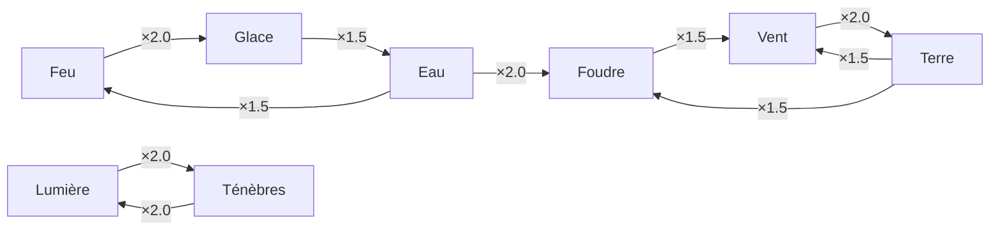

# 🔥 Matrice d'Affinité Élémentaire — ALfheim Online
## The Seed Engine — Module Élémentaire

> **Version** : 1.0  
> **Dernière mise à jour** : 2026-07-06  
> **Lecture** : Ligne = Élément d'ATTAQUE, Colonne = Élément de DÉFENSE

---

## 📊 Matrice des Multiplicateurs de Dégâts (8×8)

| Attaque ↓ \ Défense → | 🔥 Feu | 💧 Eau | 🌪️ Vent | 🪨 Terre | ✨ Lumière | 🌑 Ténèbres | ⚡ Foudre | ❄️ Glace |
|:---|:---:|:---:|:---:|:---:|:---:|:---:|:---:|:---:|
| **🔥 Feu** | ×0.25 | ×0.5 | ×1.0 | ×1.5 | ×1.0 | ×1.0 | ×1.0 | ×2.0 |
| **💧 Eau** | ×1.5 | ×0.25 | ×0.5 | ×1.0 | ×1.0 | ×1.0 | ×2.0 | ×0.5 |
| **🌪️ Vent** | ×1.0 | ×1.5 | ×0.25 | ×0.5 | ×1.0 | ×1.0 | ×0.5 | ×1.0 |
| **🪨 Terre** | ×0.5 | ×1.0 | ×2.0 | ×0.25 | ×1.0 | ×1.0 | ×1.5 | ×1.0 |
| **✨ Lumière** | ×1.0 | ×1.0 | ×1.0 | ×1.0 | ×0.25 | ×2.0 | ×1.5 | ×1.0 |
| **🌑 Ténèbres** | ×1.0 | ×1.0 | ×1.0 | ×1.0 | ×2.0 | ×0.25 | ×1.0 | ×1.5 |
| **⚡ Foudre** | ×1.0 | ×0.5 | ×1.5 | ×0.5 | ×1.0 | ×1.0 | ×0.25 | ×1.5 |
| **❄️ Glace** | ×0.5 | ×1.5 | ×1.0 | ×1.0 | ×1.0 | ×0.5 | ×1.0 | ×0.25 |

---

## 📖 Légende des Multiplicateurs

| Multiplicateur | Catégorie | Effet | Couleur |
|---:|:---|:---|:---|
| ×0.25 | **Immunité** | Même élément — dégâts quasi nuls | 🟢 |
| ×0.5 | **Résistance** | L'élément résiste fortement | 🔵 |
| ×1.0 | **Neutre** | Pas d'interaction spéciale | ⚪ |
| ×1.5 | **Faiblesse** | Dégâts augmentés | 🟡 |
| ×2.0 | **Vulnérabilité Critique** | Dégâts doublés | 🔴 |

---

## 🔄 Relations Élémentaires — Cycle Principal

```
Feu → Glace → Vent → Terre → Foudre → Eau → Feu
(chaque élément a ×1.5 ou ×2.0 contre le suivant)
```

### Cycle de Dominance



---

## ⚔️ Paires de Vulnérabilité Critique (×2.0)

| Attaque | Défense | Logique |
|:---|:---|:---|
| 🔥 Feu | ❄️ Glace | Le feu fait fondre la glace |
| 💧 Eau | ⚡ Foudre | L'eau conduit l'électricité |
| 🌪️ Vent | — | Pas de vulnérabilité ×2.0 infligée |
| 🪨 Terre | 🌪️ Vent | Les roches brisent les courants d'air |
| ✨ Lumière | 🌑 Ténèbres | La lumière dissipe les ténèbres |
| 🌑 Ténèbres | ✨ Lumière | Les ténèbres corrompent la lumière |
| ⚡ Foudre | — | Pas de vulnérabilité ×2.0 infligée |
| ❄️ Glace | — | Pas de vulnérabilité ×2.0 infligée |

> **Note** : Lumière ↔ Ténèbres est un cycle **mutuel** de vulnérabilité ×2.0.

---

## 🧬 Interaction avec les Races

| Race | Élément Racial | Immunité (×0.25) | Résistance (×0.5) | Vulnérabilité |
|:---|:---|:---|:---|:---|
| Sylph | Vent | Vent | — | Terre (×1.5) |
| Salamander | Feu | Feu | — | Eau (×1.5) |
| Cait Sith | Terre | — | Terre (×0.75) | Foudre (×1.25) |
| Undine | Eau | Eau | — | Foudre (×1.5) |
| Imp | Ténèbres | — | Ténèbres (×0.5) | Lumière (×1.5) |
| Gnome | Terre | Terre | — | Vent (×1.5) |
| Puca | Lumière | — | Lumière (×0.75) | Ténèbres (×1.25) |
| Spriggan | Ténèbres | — | Ténèbres (×0.75) | Lumière (×1.25) |
| Leprechaun | Feu | — | Feu (×0.75) | Eau (×1.25) |

---

## 🧮 Formule de Calcul des Dégâts Élémentaires

```
Dégâts_Élémentaires = MATK × Puissance_Sort × Multi_Élément × (1 - MDEF_Cible / (MDEF_Cible + 200))

Où :
- MATK = INT × 3.0 + DEX × 0.5 + Bonus_Baguette
- Puissance_Sort = valeur définie par le sort utilisé
- Multi_Élément = valeur de la matrice (ligne attaque, colonne défense)
- MDEF_Cible = Défense Magique de la cible
```

---

## 🌀 Réactions Élémentaires (Combinaisons)

Lorsque **deux éléments** sont appliqués consécutivement sur la même cible, une **réaction** peut se déclencher :

| Élément 1 | Élément 2 | Réaction | Effet |
|:---|:---|:---|:---|
| 🔥 Feu | 🌪️ Vent | **Tempête de Feu** | +50% dégâts de Feu, AoE élargie ×1.5 |
| 💧 Eau | ❄️ Glace | **Congélation** | Immobilise la cible pendant 3s |
| ⚡ Foudre | 💧 Eau | **Électrocution** | Dégâts continus (5% MATK / sec) pendant 6s |
| 🪨 Terre | 🔥 Feu | **Éruption** | Explosion AoE de 5m, +80% dégâts |
| 🌪️ Vent | ❄️ Glace | **Blizzard** | Ralentissement de zone (-40% vitesse) 8s |
| ✨ Lumière | 🌑 Ténèbres | **Annihilation** | Dégâts purs (ignore toutes les résistances) |
| ⚡ Foudre | 🪨 Terre | **Fracture Sismique** | Brise la DEF de la cible (-25% DEF) 10s |
| 🔥 Feu | ❄️ Glace | **Choc Thermique** | Stun 2s + dégâts moyens des deux éléments |
| 💧 Eau | 🌪️ Vent | **Tornade Aquatique** | Éjecte les ennemis + dégâts continus 4s |
| 🌑 Ténèbres | ❄️ Glace | **Gel Obscur** | -50% regen HP/MP pendant 10s |

> **Cooldown de réaction** : 15 secondes avant qu'une nouvelle réaction puisse être déclenchée sur la même cible.

---

## 🛡️ Enchantements Élémentaires sur Équipement

| Enchantement | Effet sur Arme | Effet sur Armure | Coût (Yrds) |
|:---|:---|:---|---:|
| Feu | +15% dégâts feu ajoutés | +10% résist. feu | 500 |
| Eau | +15% dégâts eau ajoutés | +10% résist. eau | 500 |
| Vent | +8% vitesse d'attaque | +8% esquive | 600 |
| Terre | +10% chance de stagger | +12% résist. physique | 550 |
| Lumière | +12% dégâts vs Morts-Vivants | +10% résist. ténèbres | 700 |
| Ténèbres | +10% vol de vie (leech) | +10% résist. lumière | 700 |
| Foudre | +5% chance de paralysie | +8% résist. foudre | 650 |
| Glace | +8% chance de ralentissement | +8% résist. glace | 600 |

---

## 📊 Résistances Élémentaires — Caps

| Source | Maximum Cumulé |
|:---|---:|
| Résistance raciale innée | 25% |
| Enchantement d'armure | 15% par pièce (5 pièces = 75% max) |
| Buffs temporaires | 20% |
| **Total Maximum** | **85%** (hard cap) |

> **Note** : Le hard cap de 85% garantit qu'aucun joueur ne peut devenir totalement immunisé à un élément via le stacking de résistances.
